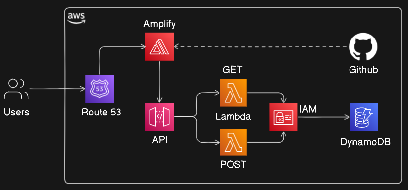

# AWS_SERVERLESS_DEPLOYMENT
AWS Serverless Student Data Web App

# 🎓 AWS Serverless Student Data Web App

A simple serverless web app project built as part of my cloud engineering training at Apponix Academy and Thrive Africa Projects.

## 💻 Features
- Users can **add student details** via a frontend form
- Student data is stored and retrieved using **AWS DynamoDB**
- Lambda functions invoked by **API GATEWAY** to access DB
- Backend logic handled by **AWS Lambda** using Python runtime 13.12
- Allowed access to read & write to Database using **Identity & Access Managements**
- App is hosted on **AWS Amplify** with a custom domain via **Route 53** bought from Namecheap
- Source code managed via **GitHub with Amplify CI/CD integration**

## 🚀 Tech Stack
- **Frontend:** HTML/CSS/JS (hosted on Amplify)
- **Backend:** AWS Lambda (Python 13.12)
- **POLICY:** IAM
- **Post & Get**  API GATEWAY
- **Database:** AWS DynamoDB
- **CI/CD:** GitHub + Amplify
- **Domain:** Route 53 custom domain

## 📂 AWS SERVERLESS Architecture

## 📘 Learning Outcomes
This project helped me:
- Understand serverless web architectures
- Integrate multiple AWS services securely
- Apply IAM roles and policies correctly
- Practice Git-based CI/CD workflows

---

Feel free to clone, fork, or give feedback!

